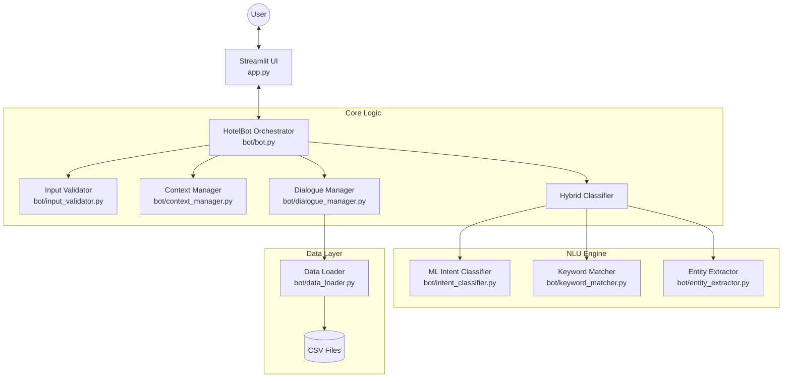
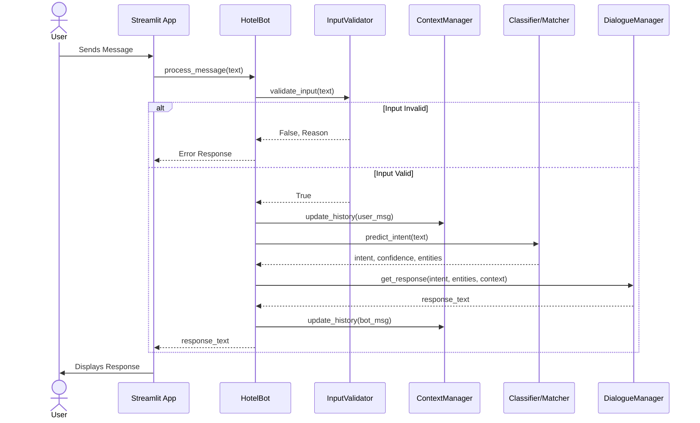
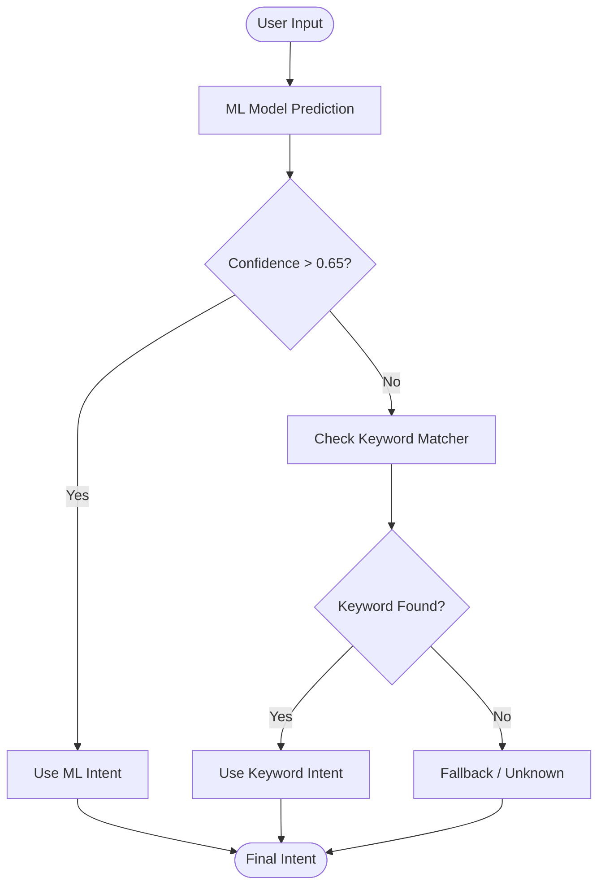
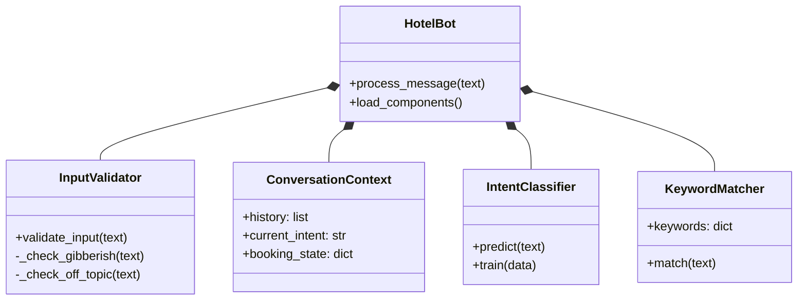

# Hotel Chatbot System Diagrams

To view these diagrams visually:
1. Open this file in VS Code.
2. Press `Ctrl+Shift+V` (or `Cmd+Shift+V` on Mac) to open the **Markdown Preview**.

## 1. High-Level System Architecture
This diagram shows how the different Python modules interact with each other.



## 2. Message Processing Sequence
This sequence diagram illustrates the step-by-step flow of a single user message.



## 3. Hybrid Intent Logic
This flowchart details how the bot decides between Machine Learning and Keyword Matching.



## 4. Input Validation Logic
The decision tree used to filter out bad inputs before processing.

```mermaid
graph TD
    Input([Raw Input]) --> Empty{Is Empty?}
    Empty -- Yes --> Reject[Reject: Empty]
    Empty -- No --> Gibberish{Is Gibberish?<br>(Random chars)}
    
    Gibberish -- Yes --> Reject2[Reject: Gibberish]
    Gibberish -- No --> Identity{Is Identity Q?<br>'Who are you?'}
    
    Identity -- Yes --> Accept[Accept]
    Identity -- No --> OffTopic{Is Off-Topic?<br>(Politics/Insults)}
    
    OffTopic -- Yes --> Reject3[Reject: Off-Topic]
    OffTopic -- No --> Accept
```

## 5. Class Structure
The object-oriented structure of the codebase.


