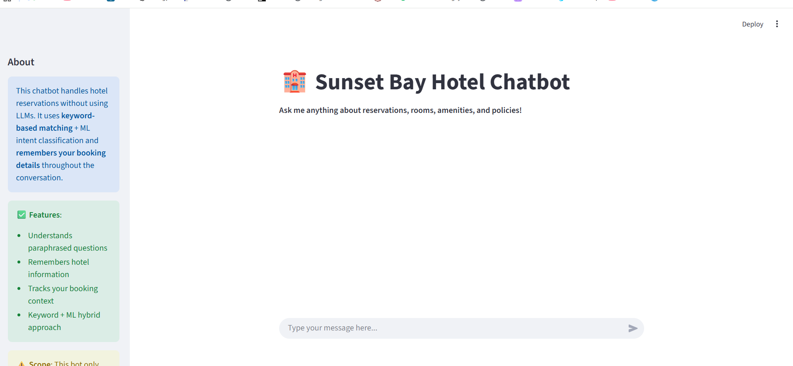

# Hotel Reservation Chatbot

A self-contained, non-LLM hotel reservation assistant trained on the synthetic dataset in `data/`. It classifies user intents with a traditional ML model, extracts structured entities with rules, and renders responses via deterministic templates.

## UI Screenshots
<p align="center">
  
  
  
</p>

## Architecture at a Glance
- **Intent classification**: `scikit-learn` TF-IDF + Logistic Regression pipeline trained on `data/training_data.csv`.
- **Entity extraction**: Rule-based parser in `bot/entity_extractor.py` detects dates, guest counts, reservation IDs, room types, and amenities.
- **Knowledge layer**: `data_loader.py` loads hotel metadata, room inventory, amenity FAQ, and response templates.
- **Dialogue policy**: `dialogue_manager.py` fills templates with hotel facts and extracted slots, including price estimation logic.
- **Orchestration**: `HotelChatbot` stitches everything together and powers the CLI in `run_chatbot.py`.

## Setup
```powershell
# Create a virtual environment
python -m venv .venv

# Activate the virtual environment
# Windows:
.\.venv\Scripts\Activate.ps1
# Linux/Mac:
# source .venv/bin/activate

# Install dependencies
pip install --upgrade pip
pip install -r requirements.txt
```

## Train & Run the Bot
```powershell
# Run the CLI chatbot
python run_chatbot.py

# Run the Streamlit Web UI
streamlit run app.py
```
- The script trains a fresh intent model (≈10s) and launches an interactive prompt.
- Use `--no-train` to reuse the last saved model in `artifacts/`.

## Quick Analysis Helper
Inside Python:
```python
from bot import HotelChatbot
bot = HotelChatbot(auto_train=True)
bot.analyze("book a suite for 2 adults 2025-12-10")
```
Returns top intents plus extracted entities for debugging.

## Tests
```powershell
python -m unittest discover -s tests
```

## Customization Tips
1. Update `data/*.csv` with new hotel facts or paraphrased utterances, then rerun `generate_dataset.py` if needed.
2. Extend `EntityExtractor` with new regex patterns for loyalty IDs, promo codes, etc.
3. Adjust `confidence_threshold` in `HotelChatbot` to tune fallback behavior.
4. Bring your own UI (web, SMS, IVR) by importing `HotelChatbot` and wiring the `respond()` output into your channel.
